# (C# 코딩) Login Screen

##  개요
- C# 프로그래밍 학습
- 1줄 소개: 로그인 화면을 구현하는 C# 프로젝트
- 사용한 플랫폼:
  - C#, .Net Windows Forms, Visual Studio, GitHub
- 사용한 컨트롤:
  -Label, TextBox, Button, MessageBox
- 사용한 기술과 구현한 기능:
  -Visual Studio를 이요한 UI 구성
  -로그인 버튼 클릭 시 입력된 아이디와 패스워드 검증
  -로그인 성공 시 메시지 박스 표시
  -로그인 실패 시 오류 메시지 표시
  -아이디와 패스워드 입력 필드 초기화
  -Enter 키로 아이디, 패스워드, 로그인 이동 및 로그인 기능 구현
  -Visible 속성을 이용한 로그인 성공 메시지 표시

## 실행 화면 (과제1)
- 과제1 코드의 실행 스크린샷

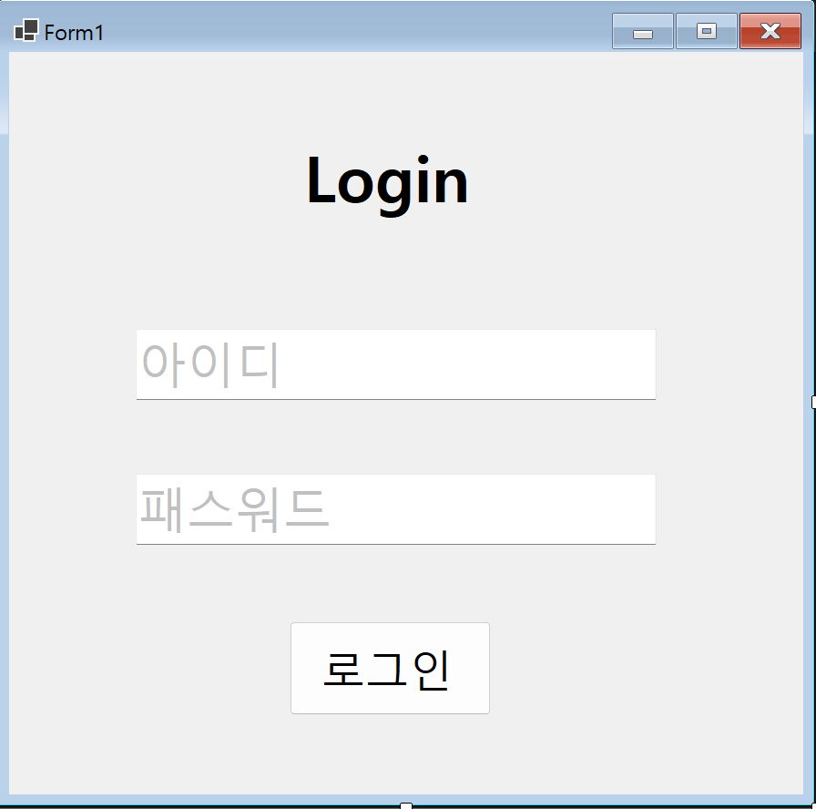
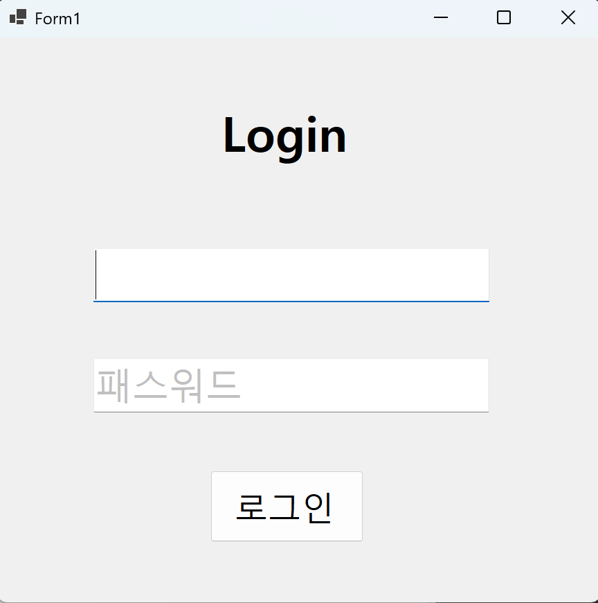
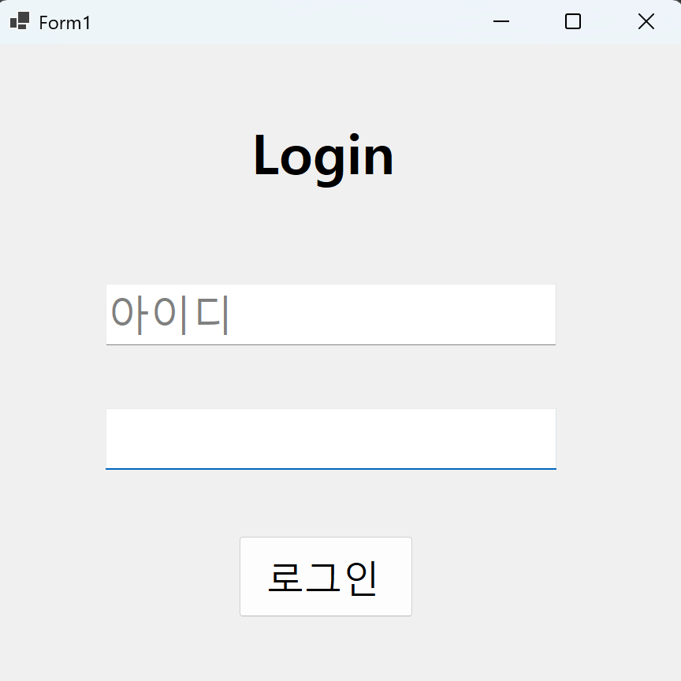
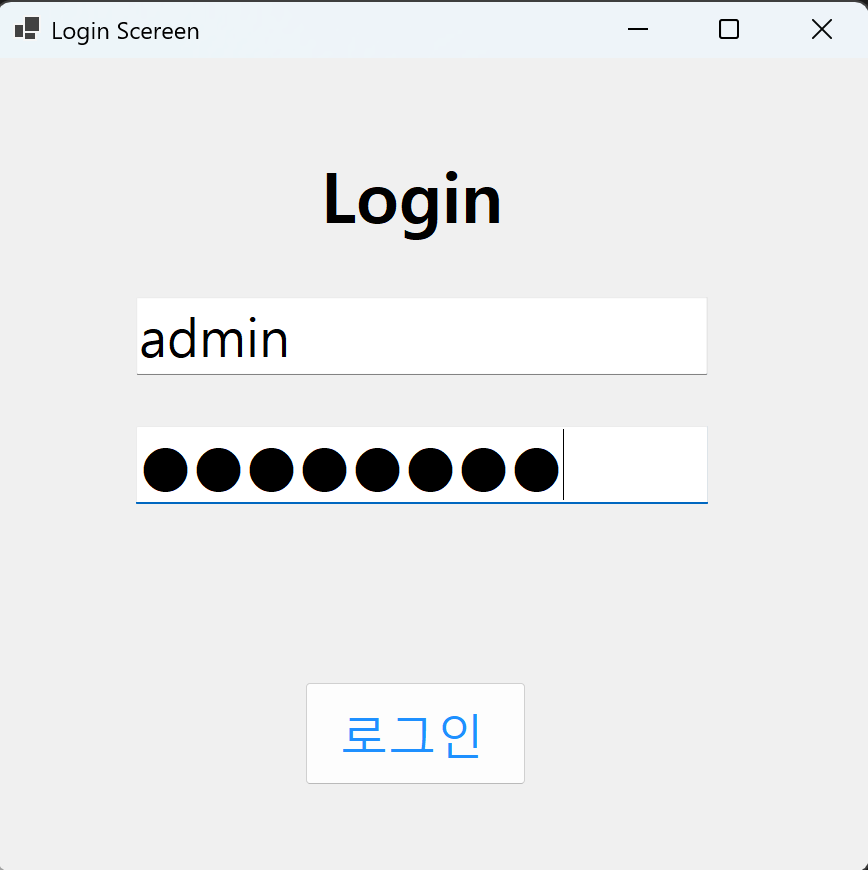
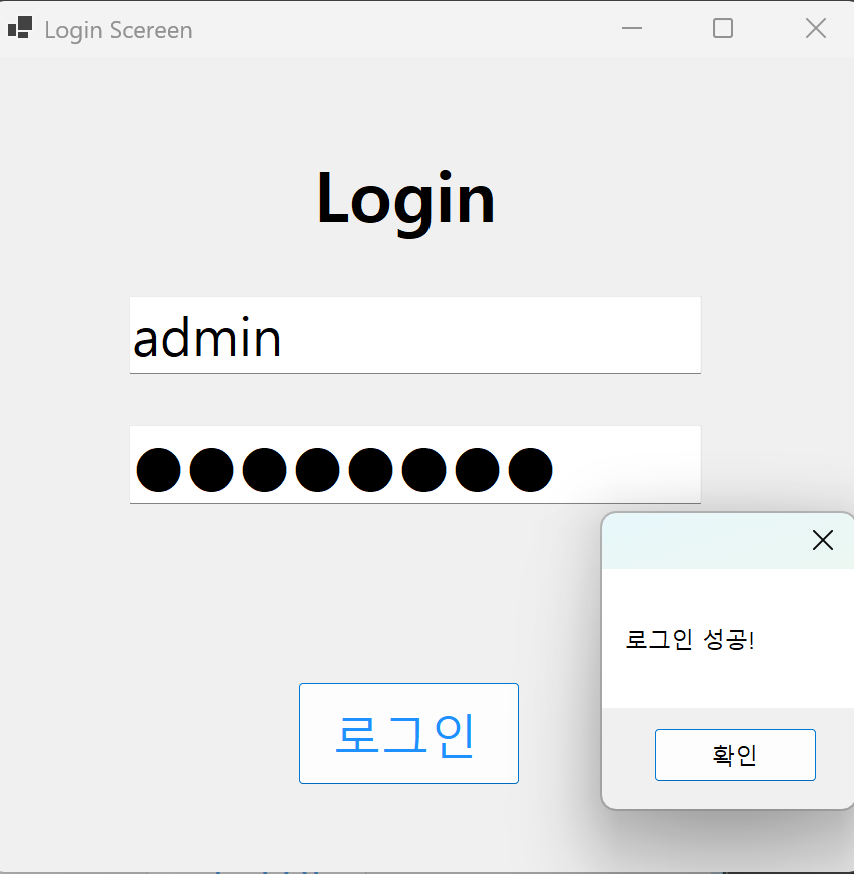

-과제 내용
  - 구성 ▶TextBox(아이디, 패스워드), Button(로그인) 등을 적절히 배치합니다.
  - Placeholder 표시 ▶아이디와 패스워드 입력힌트를 회색으로 표시
  - 로그인 가능 여부 체크 기능 ▶아이디와 패스워드가 모두 맞아야 로그인 허용
  - 로그인 성공/실패 메시지 박스 보여주기 ▶적절한 메시지 박스 사용

-구현 내용과 기능 설명
  - VIsual Studio의 Windows Forms 디자이너를 이용하여 UI 구성
  - TextBox의 Enter와 Leave 이벤트를 활용하여 Placeholder 기능 구현
  - 로그인 버튼 클릭 시 입력된 아이디와 패스워드 검증하여 로그인 가능 여부 체크
  - MessageBox를 이용하여 로그인 성공 또는 실패 메시지 표시 

## 실행 화면 (과제2)
- 과제2 코드의 실행 스크린샷

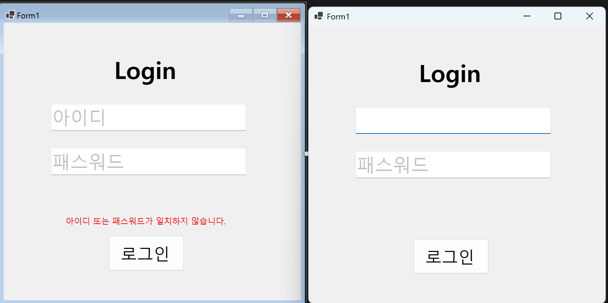
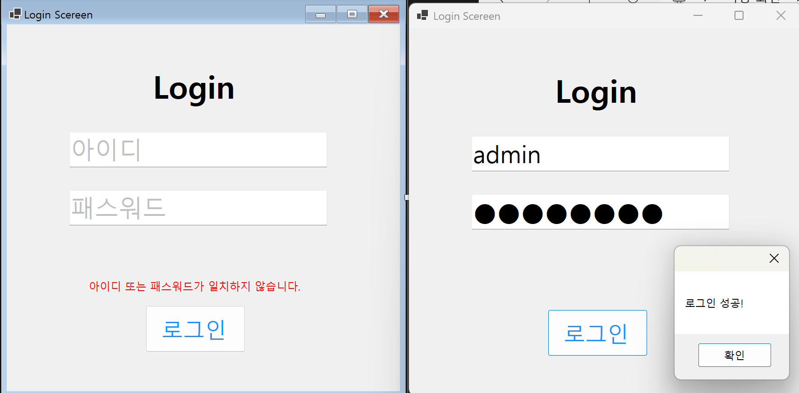
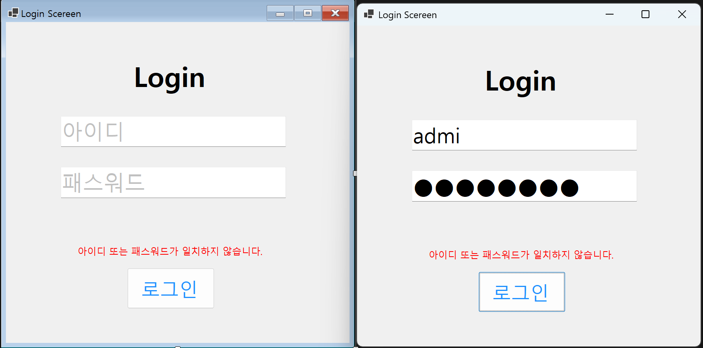
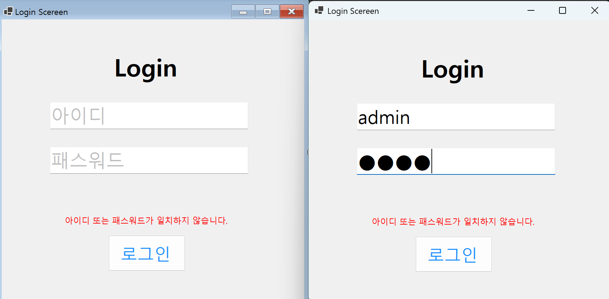

-과제 내용
  - Label 컨트롤 추가
  - Visible 속성을 이용해서 메시지 보이기와 숨기기 기능 구현
  - UX개선 
  - 어디에 어떻게 보여주는게 좋은가?
  - 남들은어떻게하고있나?

-구현 내용과 기능 설명
  - Label 컨트롤을 추가하여 로그인 성공 메시지 표시
  - 로그인 버튼 클릭 시 로그인 성공 여부에 따라 Label의 Visible 속성을 조절하여 메시지 보이기와 숨기기 기능 구현
  - UX 개선을 위해 로그인 성공 메시지를 적절한 위치에 배치하고, 디자인 요소를 활용하여 사용자에게 명확하게 전달되도록 구현

## 실행 화면 (과제3)
- 과제3 코드의 실행 스크린샷

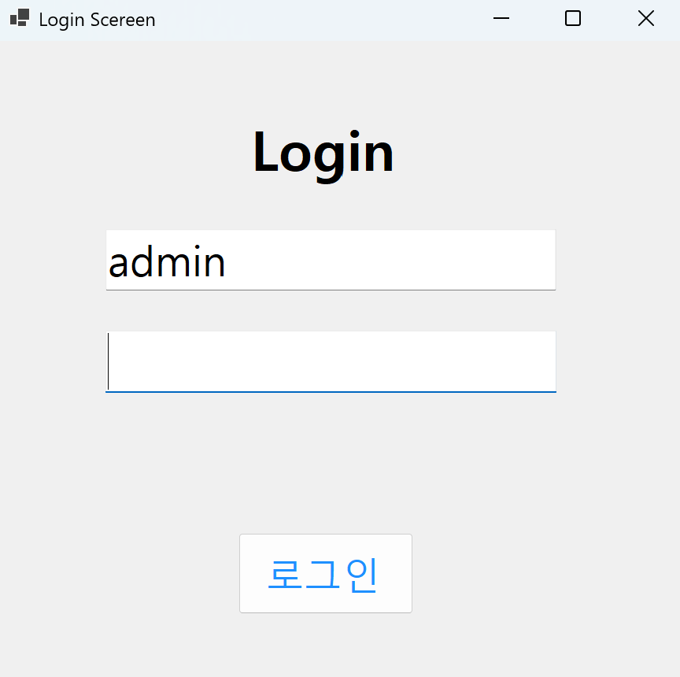
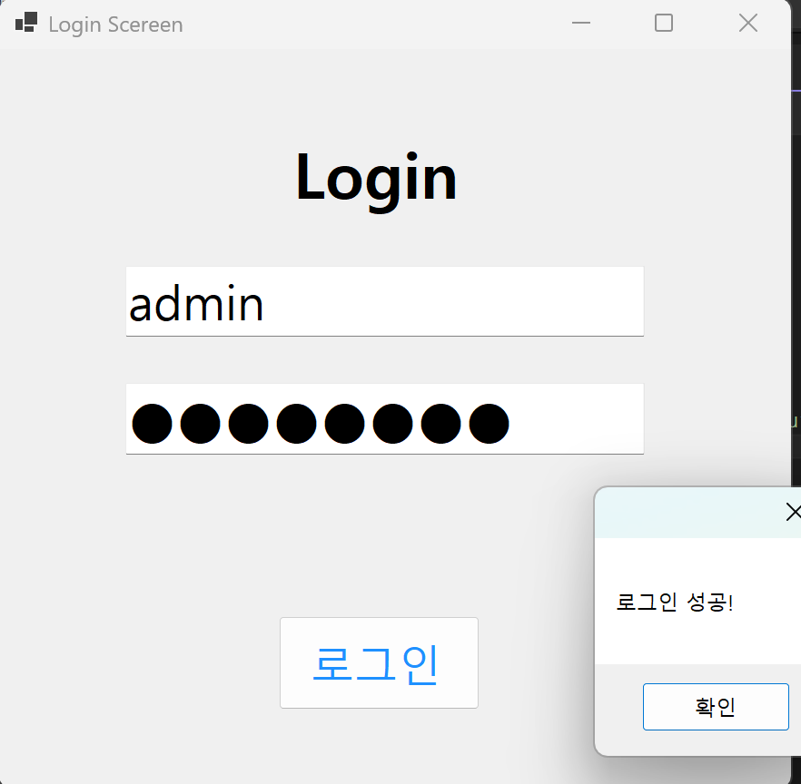

-과제 내용

-구현 내용과 기능 설명
  - Enter키를 치면 로그인 되도록 포커스 흐름 정리
    - ▶아이디 입력하고 Enter키 치면 패스워드 입력창으로 넘어가기
    - ▶패스워드 입력하고 Enter키 치면 로그인 시작하기
  - 편리한UI/UX 구현하기 
      - ▶전체를 지우는 기능
      - ▶패스워드를 보여주는 기능

## 실행 화면 (과제4)
- 과제4 코드의 실행 스크린샷

-과제 내용
  - 아이디와 패스워드 입력 문자 확인
    - ▶아이디에 넣을 수 없는 글자 체크
    - ▶비밀번호에 넣을 수 없거나 꼭 들어가야하는 문자체크
  - 로그인 시도 제한
    - ▶일정 회수가 지나면 정해진 시간후에 재시도 가능하게
    - ▶한단계 더 체크하기
    - ▶조금 더 복잡하고 어렵게 만들기

-구현 내용과 기능 설명
  - 아이디 입력 시 사용할 수 없는 글자 체크 기능 구현
  - 패스워드 입력 시 사용할 수 없는 글자 또는 반드시 포함되어야 하는 문자 체크 기능 구현
  - 일정 횟수 이상 로그인 실패 시 일정 시간 동안 로그인 시도 불가능하도록 구현
  - 추가적으로 보안 강화를 위해 추가적인 체크 기능 구현
  